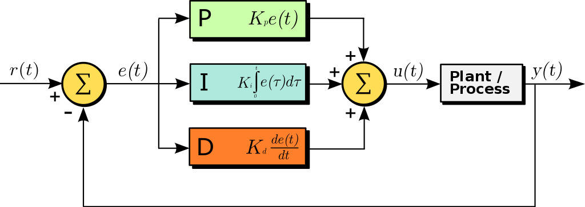

# CarND-PID-Controller
Self-Driving Car Engineer Nanodegree Program

**## Introduction  
A proportional–integral–derivative controller (**PID controller** or three-term controller) is a control loop mechanism employing feedback that is widely used in industrial control systems and a variety of other applications requiring continuously modulated control. A PID controller continuously calculates an error value e(t) as the difference between a desired setpoint (SP) and a measured process variable (PV) and applies a correction based on proportional, integral, and derivative terms (denoted P, I, and D respectively), hence the name.  
The distinguishing feature of the PID controller is the ability to use the three control terms of proportional, integral and derivative influence on the controller output to apply accurate and optimal control.

  

### Proportional (P) Control  
Let's say ego car moves with a constant velocity and our reference trajectory would be the x-axis. Thus, the y-axis will represent the distance between the ego car and the reference trajectory line. Let's call this Cross-Track-Error (CTE in short).  
So, how do we set the steering angle?  

In proportional control, **steering_angle = -t * CTE**  (t is a factor)  

The problem with the proportional control is that the ego car overshoots!  

### Proportional-Derivative (PD) Control  
To avoid overshooting problem coming with the proportional control, derivative (D) term is added. As ego car moves with the initial steering angle, the CTE would decrease for a period of time. However, the steering angle is also needed to be decreased as well.  

In proportional-derivative control, **steering_angle = -tp * CTE - td * (d/dt)CTE**  

If there is a systematic bias (e.g. a misalignment between front-wheel angles mechanically), the PD controller can not handle this.

### Proportional-Integral-Derivative (PID) Control  
To overcome the overshooting problem and the systematic bias, proportional–integral–derivative controller is used.  
An example plot is provided below to compare p, pi and pid controllers.

  

## Dependencies

* cmake >= 3.5
 * All OSes: [click here for installation instructions](https://cmake.org/install/)
* make >= 4.1(mac, linux), 3.81(Windows)
  * Linux: make is installed by default on most Linux distros
  * Mac: [install Xcode command line tools to get make](https://developer.apple.com/xcode/features/)
  * Windows: [Click here for installation instructions](http://gnuwin32.sourceforge.net/packages/make.htm)
* gcc/g++ >= 5.4
  * Linux: gcc / g++ is installed by default on most Linux distros
  * Mac: same deal as make - [install Xcode command line tools]((https://developer.apple.com/xcode/features/)
  * Windows: recommend using [MinGW](http://www.mingw.org/)
* [uWebSockets](https://github.com/uWebSockets/uWebSockets)
  * Run either `./install-mac.sh` or `./install-ubuntu.sh`.
  * If you install from source, checkout to commit `e94b6e1`, i.e.
    ```
    git clone https://github.com/uWebSockets/uWebSockets 
    cd uWebSockets
    git checkout e94b6e1
    ```
    Some function signatures have changed in v0.14.x. See [this PR](https://github.com/udacity/CarND-MPC-Project/pull/3) for more details.
* Simulator. You can download these from the [project intro page](https://github.com/udacity/self-driving-car-sim/releases) in the classroom.

Fellow students have put together a guide to Windows set-up for the project [here](https://s3-us-west-1.amazonaws.com/udacity-selfdrivingcar/files/Kidnapped_Vehicle_Windows_Setup.pdf) if the environment you have set up for the Sensor Fusion projects does not work for this project. There's also an experimental patch for windows in this [PR](https://github.com/udacity/CarND-PID-Control-Project/pull/3).

## Basic Build Instructions

1. Clone this repo.
2. Make a build directory: `mkdir build && cd build`
3. Compile: `cmake .. && make`
4. Run it: `./pid`. 

Tips for setting up your environment can be found [here](https://classroom.udacity.com/nanodegrees/nd013/parts/40f38239-66b6-46ec-ae68-03afd8a601c8/modules/0949fca6-b379-42af-a919-ee50aa304e6a/lessons/f758c44c-5e40-4e01-93b5-1a82aa4e044f/concepts/23d376c7-0195-4276-bdf0-e02f1f3c665d)

## Project Instructions and Rubric

Note: regardless of the changes you make, your project must be buildable using
cmake and make!

More information is only accessible by people who are already enrolled in Term 2
of CarND. If you are enrolled, see [the project page](https://classroom.udacity.com/nanodegrees/nd013/parts/40f38239-66b6-46ec-ae68-03afd8a601c8/modules/f1820894-8322-4bb3-81aa-b26b3c6dcbaf/lessons/e8235395-22dd-4b87-88e0-d108c5e5bbf4/concepts/6a4d8d42-6a04-4aa6-b284-1697c0fd6562)
for instructions and the project rubric.

**Compilation**  
The code can compile.  
    


**Implementation**  
It's encouraged to be creative, particularly around hyperparameter tuning/optimization.  
However, the base algorithm should follow what's presented in the lessons.  

**Reflection**  
Student describes the effect of the P, I, D component of the PID algorithm in their implementation. Is it what you expected?  

Visual aids are encouraged, i.e. record of a small video of the car in the simulator and describe what each component is set to.  

Student discusses how they chose the final hyperparameters (P, I, D coefficients). This could be have been done through manual tuning, twiddle, SGD, or something else, or a combination!  

**Simulation**  
No tire may leave the drivable portion of the track surface. The car may not pop up onto ledges or roll over any surfaces that would otherwise be considered unsafe (if humans were in the vehicle).  

    

### References  
Udacity's Q&A Session: https://www.youtube.com/watch?v=YamBuzDjrs8
https://en.wikipedia.org/wiki/PID_controller


